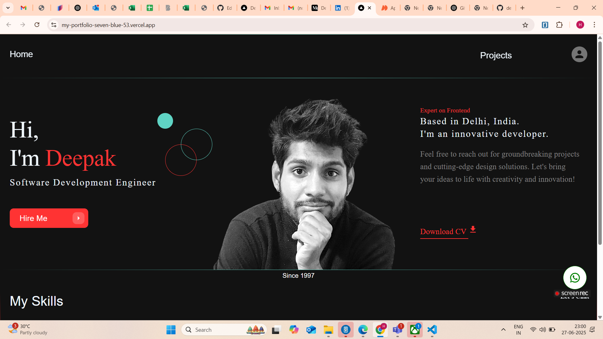
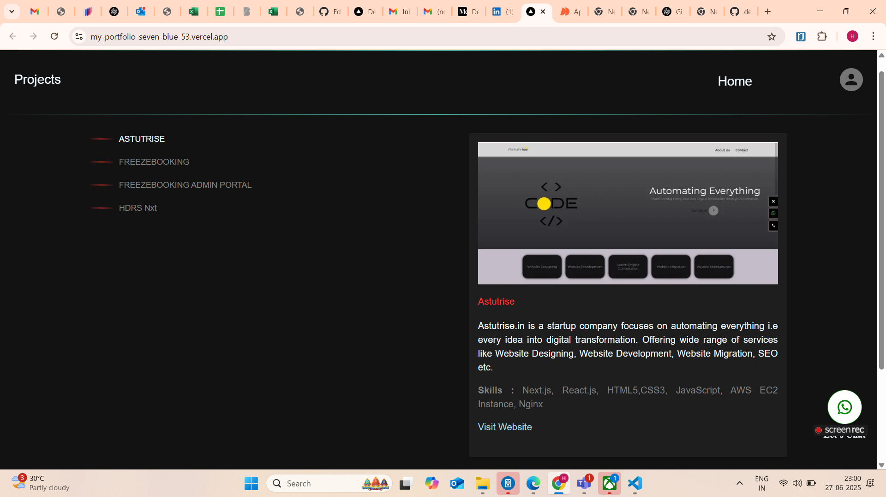
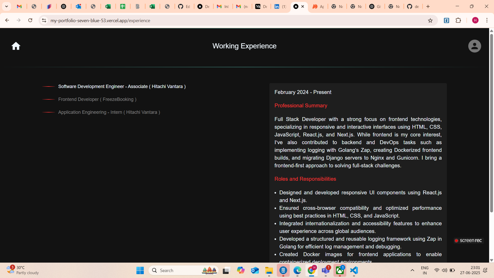
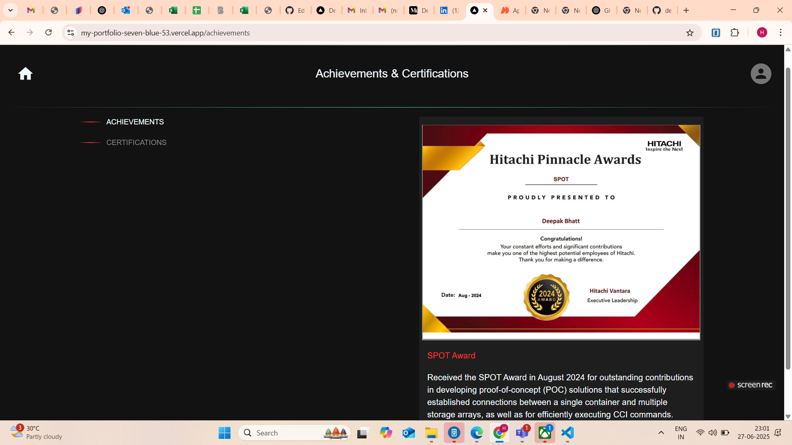
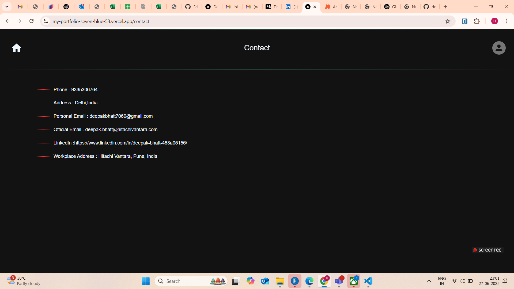

# 🚀 Project Name
 My Portfolio
## 📄 Description
My Portfolio as Frontend Heavy Full Stack Developer

## 🔍 Features
- Hero Section
- Projects
- Working Experience
- Achievements and Certifications
- Contact

## 🖼️ Demo (or Screenshots)
- 
- 
- 
- 
- 

## 🌐 Live Preview
[Click here to view the project](https://my-portfolio-freezebooking.vercel.app/)

## 🛠️ Tech Stack
- React
- Next.js
- CSS
- TypeScript
- HTML

## 🧪 Installation (for running locally)
- git clone https://github.com/deepakbhatt7060/my-portfolio.git
- cd my-portfolio
- npm install
- npm run dev
